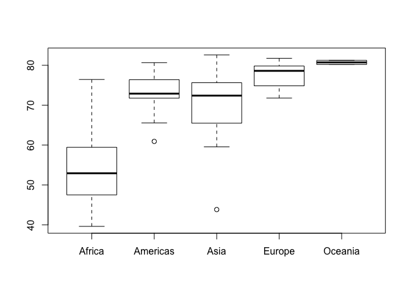
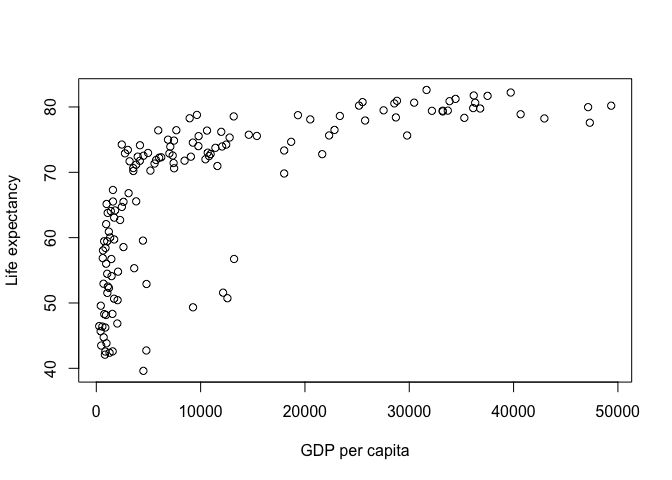
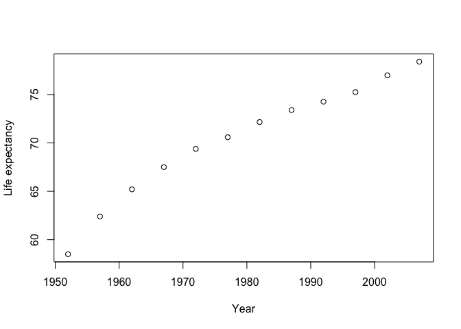

HW01 Gapminder
================
Roger Yu-Hsiang Lo
2018-09-15

Set-up
------

-   Install (if not yet) and load the `gapminder` R package.

``` r
#install.packages('gapminder')
library(gapminder)
```

-   Some sanity check to make sure the data are loaded properly.

``` r
head(gapminder)
```

    ## # A tibble: 6 x 6
    ##   country     continent  year lifeExp      pop gdpPercap
    ##   <fct>       <fct>     <int>   <dbl>    <int>     <dbl>
    ## 1 Afghanistan Asia       1952    28.8  8425333      779.
    ## 2 Afghanistan Asia       1957    30.3  9240934      821.
    ## 3 Afghanistan Asia       1962    32.0 10267083      853.
    ## 4 Afghanistan Asia       1967    34.0 11537966      836.
    ## 5 Afghanistan Asia       1972    36.1 13079460      740.
    ## 6 Afghanistan Asia       1977    38.4 14880372      786.

Basic exploration of the data
-----------------------------

-   The number of the countries included in the data set.

``` r
length(unique(gapminder$country))
```

    ## [1] 142

-   The distribution of the life expectancy across different continents in the year of 2007.

``` r
# Create another data frame with only entries from 2007
gapminder_2007 = gapminder[gapminder$year == 2007,]

# Sanity check
head(gapminder_2007)
```

    ## # A tibble: 6 x 6
    ##   country     continent  year lifeExp      pop gdpPercap
    ##   <fct>       <fct>     <int>   <dbl>    <int>     <dbl>
    ## 1 Afghanistan Asia       2007    43.8 31889923      975.
    ## 2 Albania     Europe     2007    76.4  3600523     5937.
    ## 3 Algeria     Africa     2007    72.3 33333216     6223.
    ## 4 Angola      Africa     2007    42.7 12420476     4797.
    ## 5 Argentina   Americas   2007    75.3 40301927    12779.
    ## 6 Australia   Oceania    2007    81.2 20434176    34435.

``` r
# Draw a boxplot to show the distribution
boxplot(lifeExp ~ continent, data = gapminder_2007)
```



-   Draw a scatter plot to see if there is correlation between GDP per capita and life expectancy for 2007 data.

``` r
plot(x = gapminder_2007$gdpPercap, y = gapminder_2007$lifeExp, xlab = 'GDP per capita', ylab = 'Life expectancy')
```



-   How life expectancy in Taiwan changed over years.

``` r
gapminder_taiwan = gapminder[gapminder$country == 'Taiwan',]
plot(x = gapminder_taiwan$year, y = gapminder_taiwan $ lifeExp, xlab = 'Year', ylab = 'Life expectancy')
```


